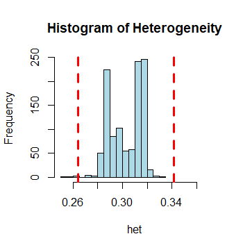

## Quality Contorls (per individual )

### Summary of Quality Control (QC) in Genetic Data

Quality control (QC) is a critical step in genetic research to prevent systematic bias, ensure data reliability, and maintain comparability across studies. A robust QC protocol minimizes false positives and ensures study validity. Below is an outline of QC types and procedures:

#### Main Types of QC
1. **Per-individual QC**: Focuses on filtering individuals with low-quality data.
2. **Per-marker QC**: Targets the quality of specific genetic markers.
3. **Genome-wide association meta-analysis QC**: Ensures consistency and quality across multiple studies.

#### Importance of QC
- Reduces errors from poor study design or genotype calling.
- Ensures protocols are pre-registered (e.g., Open Science Framework).
- Commonly conducted independently in large GWAS consortia.

#### Per-Individual QC
Filters are applied to exclude individuals introducing bias. Key steps include:
1. **Poor DNA Quality**: Remove individuals with low call rates or high levels of missing genotypes.
2. **Heterozygosity**: Exclude those with extreme heterozygosity levels, indicating contamination or inbreeding.
3. **Discordant Sex Information**: Check for mismatches between reported and genetic sex.
4. **Duplicated or Related Individuals**: Remove duplicates or closely related samples.
5. **Ancestry Differences**: Exclude individuals from different ancestry groups if needed.

A robust per-individual QC ensures data quality before further analysis.


### Identifying Individuals with Poor Genotype Quality

#### Missing Data and Low Genotype Call Rates
- **Problem**: Missing data can occur due to individuals with high rates of missing genotypes or SNPs missing in a large proportion of individuals.
- **Solution**: Remove low-quality DNA samples with high proportions of missing genotypes (commonly >3–7%).
- **PLINK Command**: Use the `--mind` option to specify a missing rate cutoff (e.g., 5% missing).
  ```bash
  ./plink --bfile 1kg_hm3 --mind 0.05 --make-bed --out 1kg_hm3_mind005


### Identification of Heterozygosity Across Autosomal Chromosomes

#### Definition
- **Heterozygosity** refers to carrying two different alleles of a specific SNP. The heterozygosity rate is the proportion of heterozygous genotypes within an individual.
- **High heterozygosity**: May indicate low sample quality or contamination.
- **Low heterozygosity**: May be due to inbreeding.

#### Why Exclude Individuals
- To ensure data quality, individuals with extreme heterozygosity levels (either high or low) are excluded.
- Deviations beyond ±3 standard deviations from the mean heterozygosity are considered outliers.

---

### Command to Calculate Heterozygosity
PLINK's `--het` command is used:
```bash
./plink --bfile 1kg_hm3 --het --out 1kg_hm3_het
```
This creates two files:

1. 1kg_hm3_het.het: Contains heterozygosity statistics for each sample.
2. .log: Log file.


**Interpretation of the 1kg_hm3_het.het File**

The .het file contains information about heterozygosity for each sample. Below is an explanation of each column and the interpretation of the given output.

Columns in the File:

**FID:** Family ID. This groups samples, but 0 indicates no family structure in this dataset.

**IID:** Individual ID. A unique identifier for each individual.

**O(HOM):** Observed number of homozygous genotype calls.

**E(HOM):** Expected number of homozygous genotype calls based on allele frequencies.

**N(NM):** Total number of non-missing genotype calls for the individual.

**F:** Inbreeding coefficient. A measure of deviation from the expected heterozygosity:
​
 
***Positive F:*** Suggests excess homozygosity (potential inbreeding or poor sample quality).

***Negative F:*** Suggests excess heterozygosity (possible sample contamination).


**$$F = \frac{E(HOM) - O(HOM)}{N(NM)}$$**

### Sample Data Interpretation

| **FID** | **IID**   | **O(HOM)** | **E(HOM)**  | **N(NM)** | **F (Inbreeding Coefficient)** | **Interpretation**                |
|---------|-----------|------------|-------------|-----------|--------------------------------|------------------------------------|
| 0       | HG00096   | 582990     | 581500      | 851065    | 0.005433                      | Near expected heterozygosity.     |
| 0       | HG00097   | 582246     | 581500      | 851065    | 0.002672                      | Near expected heterozygosity.     |
| 0       | HG00099   | 582456     | 581500      | 851065    | 0.003452                      | Slight excess homozygosity.       |
| 0       | HG00100   | 582700     | 581500      | 851065    | 0.004357                      | Slight excess homozygosity.       |
| 0       | HG00101   | 581527     | 581500      | 851065    | 0.000004929                   | Very close to expected values.    |
| 0       | HG00102   | 585010     | 581500      | 851065    | 0.01293                       | Noticeable excess homozygosity.   |
| 0       | HG00103   | 583984     | 581500      | 851065    | 0.00912                       | Moderate excess homozygosity.     |
| 0       | HG00104   | 586189     | 581500      | 851065    | 0.0173                        | Significant excess homozygosity.  |


**Summary:**

Most samples (e.g., HG00096, HG00097, HG00099) have an F value close to 0, indicating expected levels of heterozygosity and homozygosity.

HG00102, HG00103, and HG00104 show higher positive F values, indicating excess homozygosity, which may suggest inbreeding, DNA quality issues, or population stratification.

The sample HG00101 has an F value near zero, indicating ideal heterozygosity close to expectations.

This table helps identify individuals that may need to be excluded in QC processes due to outlier heterozygosity levels.


### R Script to Visualize Heterozygosity
The following R commands generate a histogram to visualize heterozygosity and mark outliers:


Interpretation of the 1kg_hm3_het.het File
The .het file contains information about heterozygosity for each sample. Below is an explanation of each column and the interpretation of the given output.

Positive F: Suggests excess homozygosity (potential inbreeding or poor sample quality).

Negative F: Suggests excess heterozygosity (possible sample contamination).


```R
# Read heterozygosity data
heterogeneity_stats <- read.table("1kg_hm3_het.het", header = TRUE)
attach(heterogeneity_stats)

# Calculate heterozygosity
het <- (N.NM. - O.HOM.) / N.NM.

# Define thresholds for outliers
min <- mean(het) - 3 * sd(het)
max <- mean(het) + 3 * sd(het)

# Generate histogram
hist(het, col = "lightblue", xlim = c(0.25, 0.37), main = "Histogram of Heterozygosity")
abline(v = c(min, max), col = "red", lwd = 3, lty = 2)
```





### Identification of Individuals with Discordant Sex Information

#### Overview
- Males, having only one X chromosome, cannot be heterozygous for X chromosome markers. This principle can be used to verify if an individual's genetic data matches their reported sex.
- **Mismatch Detection**:
  - A genotype-calling algorithm flags male heterozygotes on the X chromosome as missing.
  - PLINK calculates the X chromosome inbreeding coefficient (`F`) to compare against ascertained sex.

#### Importance
- Correct sex information is critical for analyses stratified by sex.
- **Thresholds** for the inbreeding coefficient (`F`):
  - **Males**: \( F > 0.8 \)
  - **Females**: \( F < 0.2 \)
- Individuals falling outside these thresholds are flagged as potential mismatches.

---

#### PLINK Command
To check for sex discordance, use the `--check-sex` option:
```bash
./plink --bfile hapmap-ceu --check-sex --out hapmap_sexcheck
```


Output File (.sexcheck)
The file reports discrepancies, if any, in sex data.

**Example output:**

| FID  | IID     | PEDSEX | SNPSEX | STATUS | F (Inbreeding Coefficient) |
|------|---------|--------|--------|--------|----------------------------|
| 1334 | NA12144 | 1      | 1      | OK     | 0.9999                     |
| 1334 | NA12145 | 2      | 2      | OK     | -0.06528                   |
| 1334 | NA12146 | 1      | 1      | OK     | 0.9999                     |
| 1334 | NA12239 | 2      | 2      | OK     | 0.05498                    |


**Interpretation**

***PEDSEX:*** Reported sex in pedigree file (1 = male, 2 = female).

***SNPSEX:*** Sex inferred from genotype data.

***STATUS:*** Indicates whether reported and inferred sexes match ("OK" if matched).

***F:*** Inbreeding coefficient based on X chromosome data.


# Explanation of \( F \): Inbreeding Coefficient Based on X Chromosome Data

The inbreeding coefficient (\( F \)) is a measure derived from X chromosome data to determine whether an individual’s genetic sex aligns with their reported sex. Here’s how it works:

## What is \( F \)?
- \( F \) quantifies the deviation of observed X chromosome genotypes from what would be expected for males or females.
- It measures the proportion of homozygosity (same alleles at a marker) relative to the total genotypes on the X chromosome.

## How is \( F \) Calculated?
Using PLINK's `--check-sex` option, \( F \) is computed as:  
\[
F = \frac{\text{Observed Homozygosity (O(HOM))} - \text{Expected Homozygosity (E(HOM))}}{\text{Non-Missing Genotypes (N(NM))}}
\]

- **O(HOM):** The actual number of homozygous calls on the X chromosome.
- **E(HOM):** The expected number of homozygous calls based on allele frequencies.
- **N(NM):** The total number of non-missing genotype calls on the X chromosome.

## Expected \( F \) Values by Sex
- **Males (\( F > 0.8 \)):**
  - Males have only one X chromosome, meaning nearly all their genotypes are homozygous. This results in a high \( F \)-value (close to 1).
  
- **Females (\( F < 0.2 \)):**
  - Females have two X chromosomes, which allows for heterozygosity. This results in a lower \( F \)-value (close to 0).


**Notes**
- Mismatches may indicate lab errors or data issues and require further scrutiny if numerous discrepancies are observed.
Copy code

- If many individuals in a dataset are flagged, further investigation is recommended.


# Identification of Duplicated or Related Individuals

**Importance**
It is crucial to identify duplicate individuals and cryptic relatedness (close relatives) to avoid biases in genetic analysis.

**Methods**
- **Identity by State (IBS):**
  - Measures the average proportion of alleles shared between two individuals using autosomal SNPs.
  - IBS = 1: Indicates monozygotic twins or duplicates.

- **Identity by Descent (IBD):**
  - Estimates shared ancestry using genome-wide SNPs derived from IBS:
    - IBD = 0.5: Indicates siblings.
    - IBD = 0.25: Indicates second-degree relatives.
  - Real-world data may show variation due to genotyping errors and population structure.

## Filtering
- Pairs with IBS > 0.1875 are typically removed from the analysis.
- Advanced methods like **BOLT-LMM** incorporate relatedness into computations, removing the need to exclude related individuals.

---

# Identification of Individuals of Divergent Ancestry: Population Stratification

**Importance**
Population stratification can introduce bias in association studies. Addressing this helps ensure accurate analysis.

**Common Approach**
- **Principal Component Analysis (PCA):**
  - Run PCA on a large number of genetic variants to identify high-level ancestry groups.
  - Analyses are often stratified by continental-level ancestry.

Details on relatedness calculation and filtering based on IBS, as well as PCA for population stratification, are provided in following files.
